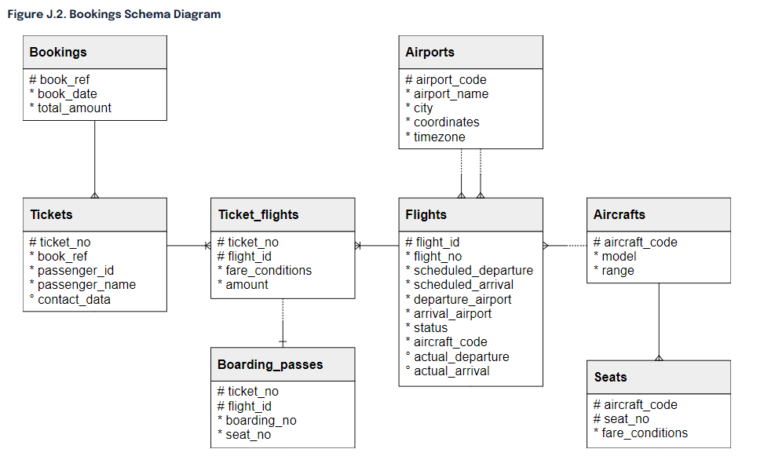
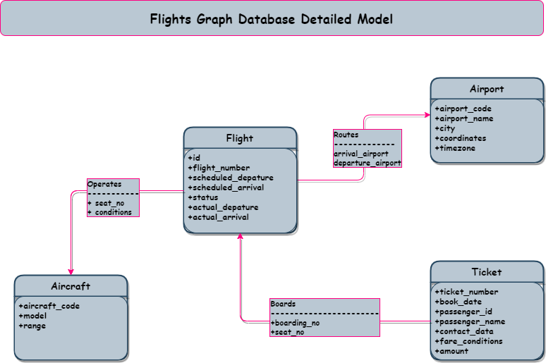

# Russian Flights 🛫🛬 Data Graph ETL Pipeline

## Description

A graph Extract Transform Load (ETL) pipeline that moves relational data about flight bookings in Russia from a PostgreSQL database into a Datastax Enterprise (DSE) graph database. The goal of the project is to demonstrate migrating data from a relational database management system RDBMS into a graph in order to leverage the power and benefits of a graph database as well as graph analytics.

## ERD Model

## Graph Schema language (GSL)

## Required Installations

- java-jdk 1.8
- maven
- docker desktop

## Project stack

* Docker compose: for container orchestration
    - postgreSQL database container
    - datastax enterprise server/ cluster (spark, cassandra, graph, dse fs)
    - datastax studo
* Scala maven project
    - FlightGraphLoaderV: writes graph vertices
    - FlightGraphLoaderE: writes graph edges

## How to run

Use make file: run "make" on command line while in root of project director /filights-graphETL/  
Alternatively: run specific commands from make file.

- dse_compose_up ➡️ start dse server
- postgres_compose_up ➡️ start postgres server
- maven_build ➡️ build project to create jar
- copy_files ➡️ copy schema and jar files to dse cluster
- create_schema ➡️ create flights schema
- build_vertices ➡️ builds flights vertices
- build_edges ➡️ builds flights edges

### Datasource reference

[postgrespro](https://postgrespro.com/docs/postgrespro/10/demodb-bookings)